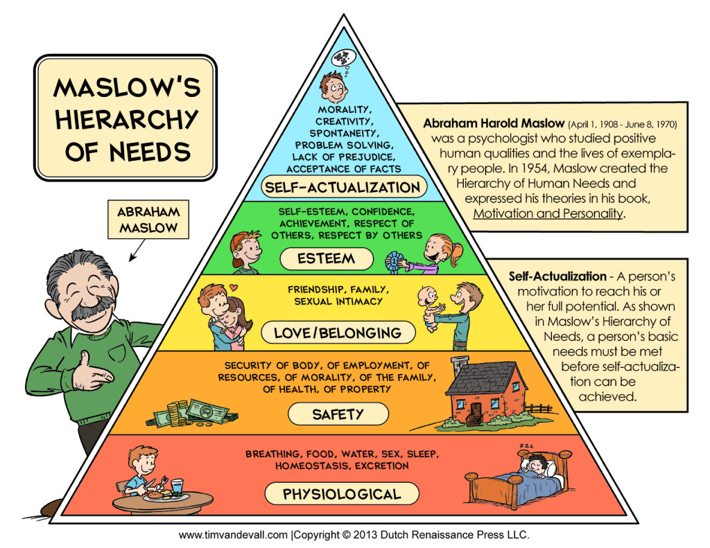
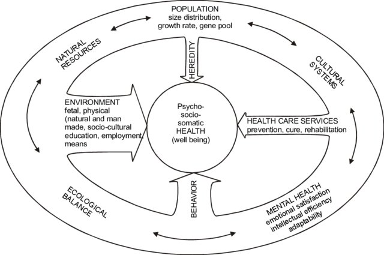
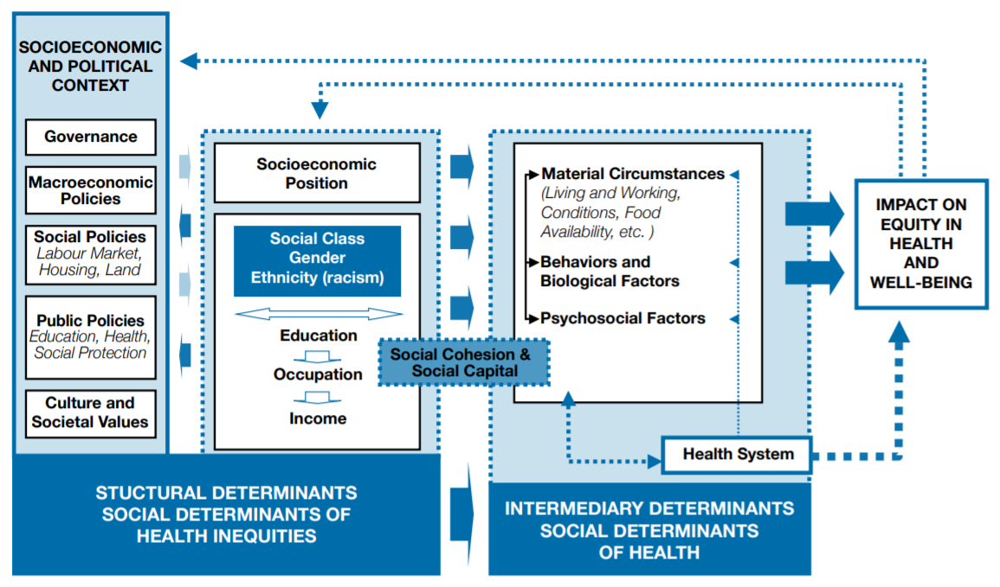

# 1. Define and Measure Health

## 1.1 Define Health

- The Oxford Dictionary - the biomedical model
> The state of being free from illness or injury
- The Merriam-Webster Dictionary - the biopsychological model
> "The condition of being sound in body, mind, or spirit"
- THe World Health Organization (WHO) - the biopsychosocial model
> "Health is a state of complete physical, mental and social well-being and not merely the absence of disease or infirmity" 
> (Preamble to the Constitution of WHO, 1946)

## 1.2 Maslaw's Hierarchy of Needs

## 1.3 The Four Dimensions of Holistic Health

- Physical 
- Mental
- Social
- Spiritual

See page 48-49.

## 1.4 Measure Health

- Quality of life 

This term is genreally used to describe an individual's wellbeing. In the context of health and healthcare, it is used to measure the outcome of healthcare (p49)

- Measure Physical Health
    - Morbidity (disease and disability)
    - Mortality (death) 
    - Life expectancy
        - Life Expectancy at Birth(LEB)
        - Healthy Life Expectancy (HALE)
        - Article: [Why is Life Expectancy Falling?](https://amp-theguardian-com.cdn.ampproject.org/v/s/amp.theguardian.com/society/2019/jun/23/why-is-life-expectancy-falling?amp_js_v=a3&amp_gsa=1#referrer=https%3A%2F%2Fwww.google.com&amp_tf=From%20%251%24s&ampshare=https%3A%2F%2Fwww.theguardian.com%2Fsociety%2F2019%2Fjun%2F23%2Fwhy-is-life-expectancy-falling)
- Measure Mental Health
    - Difficult to measure
    - Self-assessment
    - Survey and interview
- Measure Social Health (social contacts and resources)
    - Employability
    - Marital Satisfaction
    - Sociability
    - Community Involvement
- Measure Spiritual Health

## 1.5 Risk Factors and Determinants of Health
### Blum's Model of Determinants of Health (Blum, 1974)

Four facets of Blum's Model of Health Determinants together establish the health of an
individual. The thickness of each arrow indicates the magnitude of the impact of that
characteristic in this model. 
### Factors that influence an individual and a population’s health:
- Genetic make up (20% of premature deaths)
- Individual Behaviors (50% of premature deaths)
- Medical Practice (10% of premature deaths)
- Social and Environmental (20% of premature deaths)

### Five Broad Categories of DoH from Health People 2020
- Policymaking
- Social factors
    - Social Determinants of Health (SDoH)
    - Article: [Racism and Health Crisis](https://www.cnn.com/2020/08/14/health/states-racism-public-health-crisis-trnd/index.html)
- Health services
- Individual behavior
- Biology and genetics

Reference: [Determinants of Health - Healthy People 2020](https://www.healthypeople.gov/2020/about/foundation-health-measures/Determinants-of-Health)
## 1.6 WHO SDoH Conceptual Framework

