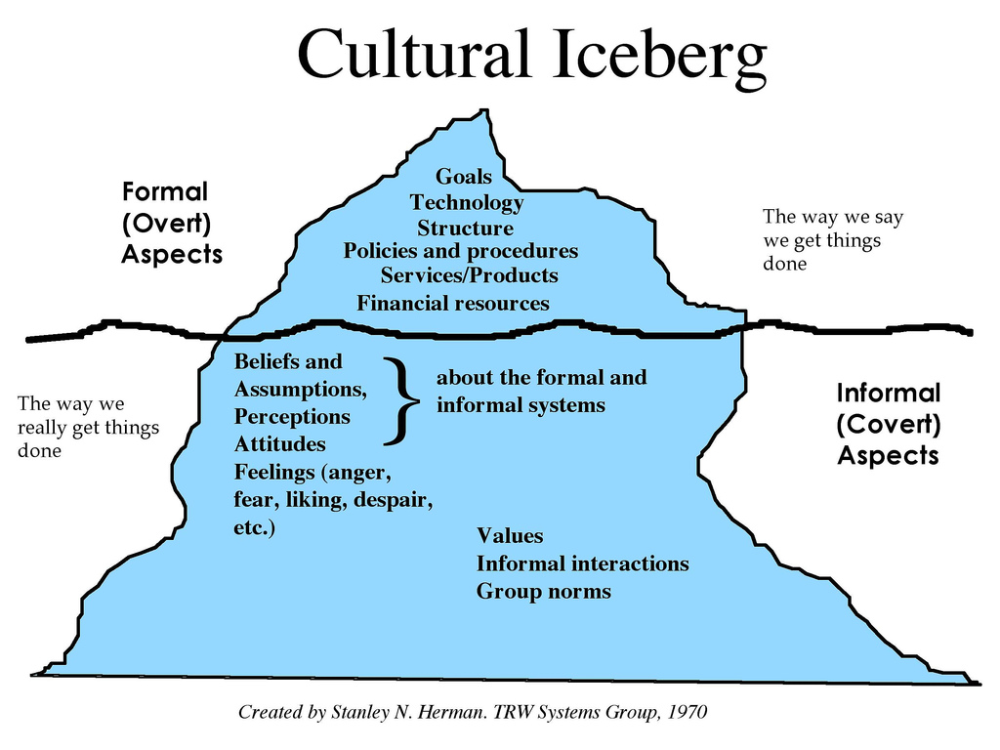

## 1. Define and Measure Health

### 1.1 Define Health

- The Oxford Dictionary - the biomedical model
> The state of being free from illness or injury
- The Merriam-Webster Dictionary - the biopsychological model
> "The condition of being sound in body, mind, or spirit"
- THe World Health Organization (WHO) - the biopsychosocial model
> "Health is a state of complete physical, mental and social well-being and not merely the absence of disease or infirmity" 
> (Preamble to the Constitution of WHO, 1046)

### 1.2 Maslaw's Hierarchy of Needs

### 1.3 The Four Dimensions of Holistic Health

- Physical 
- Mental
- Social
- Spiritual

See page 48-49.

### 1.4 Measure Health

- Quality of life 

This term is genreally used to describe an individual's wellbeing. In the context of health and healthcare, it is used to measure the outcome of healthcare (p49)

- Measure Physical Health
    - Morbidity (disease and disability)
    - Mortality (death) 
    - Life expectancy
        - Life Expectancy at Birth(LEB)
        - Healthy Life Expectancy (HALE)
        - Article: [Why is Life Expectancy Falling?](https://amp-theguardian-com.cdn.ampproject.org/v/s/amp.theguardian.com/society/2019/jun/23/why-is-life-expectancy-falling?amp_js_v=a3&amp_gsa=1#referrer=https%3A%2F%2Fwww.google.com&amp_tf=From%20%251%24s&ampshare=https%3A%2F%2Fwww.theguardian.com%2Fsociety%2F2019%2Fjun%2F23%2Fwhy-is-life-expectancy-falling)
- Measure Mental Health
    - Difficult to measure
    - Self-assessment
    - Survey and interview
- Measure Social Health (social contacts and resources)
    - Employability
    - Marital Satisfaction
    - Sociability
    - Community Involvement
- Measure Spiritual Health

### 1.5 Risk Factors and Determinants of Health

Factors that influence an individual and a population’s health:
- Genetic make up (20% of premature deaths)
- Individual Behaviors (50% of premature deaths)
- Medical Practice (10% of premature deaths)
- Social and Environmental (20% of premature deaths)

Five Broad Categories of DoH from Health People 2020
- Policymaking
- Social factors
    - Social Determinants of Health (SDoH)
    - Article: [Racism and Health Crisis](https://www.cnn.com/2020/08/14/health/states-racism-public-health-crisis-trnd/index.html)
- Health services
- Individual behavior
- Biology and genetics

Reference: [Determinants of Health - Healthy People 2020](https://www.healthypeople.gov/2020/about/foundation-health-measures/Determinants-of-Health)

## 2. Define and Measure Healthcare

### 2.1 Define Healthcare

- The Oxford Dictionary - corresponding to the biomedical model
> "The organized provision of medical care to individuals or a community"
- The Merriam-Webster Dictionary online - corresponding to the biopsychological model
> "Efforts made to maintain or restore physical, mental, or emotional well-being especially by trained
> and licensed professionals"

### 2.2 Measure Healthcare - Donabedian's Healthcare Quality Model

- Structure (macro)
    - People (healthcare professionals, communities, and organizations)
    - Technology (healthcare clinical tools and equipments)
    - Physical environments (buildings, operating rooms)
    - Resources (financial)
    - Policies and regulations
- Process (micro)
    - The activities performed by healthcare professionals
    - Clinical decision making
    - Coordination of care
    - Patient adherence
    - Family and community support
- Outcome (Macro/Micro)
    - Mortality
    - Morbility
    - Quality of Life
    - Patient satisfaction
    - Cost
    - Access
    
## 3. Define Systems and Systems Thinking

### 3.1 Define Systems

The Oxford Dictionary:
1. A set of things working together as parts of a mechanism or an interconnecting network.
2. A set of principles or procedures according to which something is done; an organized framework or method.
3. The prevailing political or social order, especially when regarded as oppressive and intransigent.

### 3.2 Define Systems of Systems (SoS)

ISO/IEC/IEEE 21839 definition:
> "Set of systems or system elements that interact to provide a unique capability that none of the constituent systems can accomplish on its own. "

### 3.3 Characteristics of a SoS (Boardman & Saucer)

- Autonomy
- Belonging
- Connectivity
- Diversity
- Emergence

## 4. Healthcare Systems

### 4.1 Define Health Disparity
 
> Health disparities are preventable differences in the burden of disease, injury, violence, or opportunities to achieve optimal health that are experienced by socially 
> disadvantaged populations. Populations can be defined by factors such as race or ethnicity, gender, education or income, disability, geographic location (e.g., rural or 
> urban), or sexual orientation. Health disparities are inequitable and are directly related to the historical and current unequal distribution of social, political, economic, 
> and environmental resources.

### 4.2 Theories of Equitable Distribution 
- Market Justice 
    - Healthcare is an economic good•
- Social Justice
    - Healthcare is a social good

### 4.3 HEALTH CARE SYSTEMS OF OTHER COUNTRIES  

Three models of national systems:
1. National health insurance (NHI)—A tax-supported national health care program in which services are financed by the government but are rendered by private providers (e.g., Canada).
2. National health system (NHS)—A tax-supported national health care program in which the government finances and also controls the service infrastructure (e.g., Great Britain).
3. Socialized health insurance (SHI)—Health care is financed through government-mandated contributions by employers and employees. Health care is delivered by private providers (e.g., Germany). 	

### 4.4 Four Aspects of US Healthcare Delivery System

- Finance
- Insurance
- Delivery
- Payment

## 5. Define Culture and its Influence on Healthcare System

### 5.1 What is Culture

- "the way of life, especially the general customs and beliefs, of a particular group of people at a particular time" - Cambridge Dictionary
- "the customary beliefs, social forms, and material traits of a racial, religious, or social group.
also : the characteristic features of everyday existence (such as diversions or a way of life) shared by people in a place or time" - Merriam Webster
- "Simply said, culture is how you were raised. It developed while you grew up. With a computer metaphor, culture is the software of our minds. We need shared software in order to communicate. So culture is about what we share with those around us. In action in social life, culture constitutes the unwritten rules of the social game." - Hofstede.

### 5.2 Edward T. Hall's Iceburg Model of Culture

### 5.3 Hofstede's 6D Model of National Culture

1. Power Distance Index (PDI)
2. Individualism vs Collectivism (IDV)
3. Masculinity vs Femininity (MAS)
4. Uncertainty Avoidance Index (UAI)
5. Long-Term Orientation (LTO) vs Short-Term Orientation (STO)
6. Indulgence vs Restraint (IVR)

### 5.4 References

- [Culturally Conscious](http://culture.pythonanywhere.com/)
- [Define Culture](https://geerthofstede.com/culture-geert-hofstede-gert-jan-hofstede/definition-culture/)
- [Six Dimensional Model of National Culture](https://geerthofstede.com/culture-geert-hofstede-gert-jan-hofstede/6d-model-of-national-culture/)

### 5.4 How National Culture influence Selection and Outcomes of Healthcare System

- Chapter 2 - Beliefs, Values, and Health
- Anthro-Cultural Beliefs and Values (Page 72-79)

## 6. Sumary

- Health is the state of holistic wellbeing, its determinants are multi-faceted, and its care requires a systemic and balanced approach.
- Healthcare is complex process involving multiple disciplines and stakeholders with diverse perspectives and interests.
- Healthcare policies seeks to optimize resource utilization and enable the collaborative effort by all stakeholders to prevent, diagnose, cure, and manage diseases and to promote healthy life styles and equitable healthcare. 
- Use data to help understand the problems and support informed evidence-based decision making

*To transform healthcare is to seek balance. A System approach is a balanced multiple-perspective approach.*
- Physical - Mental
- Dianosis - Prevention
- Treatment (acute conditions) - Management (chronic conditions)
- Behaviroal - Socioeconomic
- illness - wellness
- biological - psychological
- inpatient - outpatient
- independent institutions - integrated and collaborative systems
- individual health - population health
- fee-for-service - performance/outcome based

## 7. Looking Ahead - How this course is organizaed

### 7.1. System Resources 

This part covers the "*Structure*" aspect of the Donabedian Model. I describes the system resources that are required to deliver healthcare services:

- Health Services Professionals (People)
- Medical Technologgy (Technology)
- Health Services Financing (Money)

### 7.2. System Process

This part also covers the "*Structure*" aspect of the Donabedian Model. It describes the system structure in which healthcare is delivered:
- Outpatient and primary care services (clinics)
- Inpatient Facilities and Services (hospitals)
- Managed Care and Integrated Organizations
- Long-Term Care
- Health Services for Special Populations

### 7.3. System Outcome

This part covers the "*Outcomes*" aspect of the Donabedian Model. 
- Costs
- Access
- Quality

Note: the "Process" aspect of Donabedian model is about how healthcare is delivered. It centers around the activities performed by healthcare professionals for individual patients (micro). It is not covered in this course since this course is about population health (macro).
