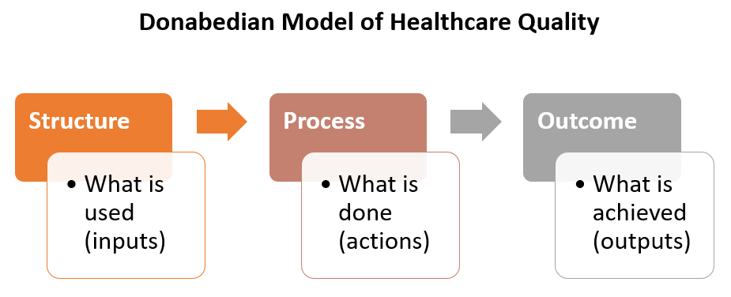

## 2. Define and Measure Healthcare

### 2.1 Define Healthcare

- The Oxford Dictionary - corresponding to the biomedical model
> "The organized provision of medical care to individuals or a community"
- The Merriam-Webster Dictionary online - corresponding to the biopsychological model
> "Efforts made to maintain or restore physical, mental, or emotional well-being especially by trained
> and licensed professionals"

### 2.2 Measure Healthcare - Donabedian's Healthcare Quality Model

- Structure (macro)
    - People (healthcare professionals, communities, and organizations)
    - Technology (healthcare clinical tools and equipments)
    - Physical environments (buildings, operating rooms)
    - Resources (financial)
    - Policies and regulations
- Process (micro)
    - The activities performed by healthcare professionals
    - Clinical decision making
    - Coordination of care
    - Patient adherence
    - Family and community support
- Outcome (Macro/Micro)
    - Mortality
    - Morbility
    - Quality of Life
    - Patient satisfaction
    - Cost
    - Access
