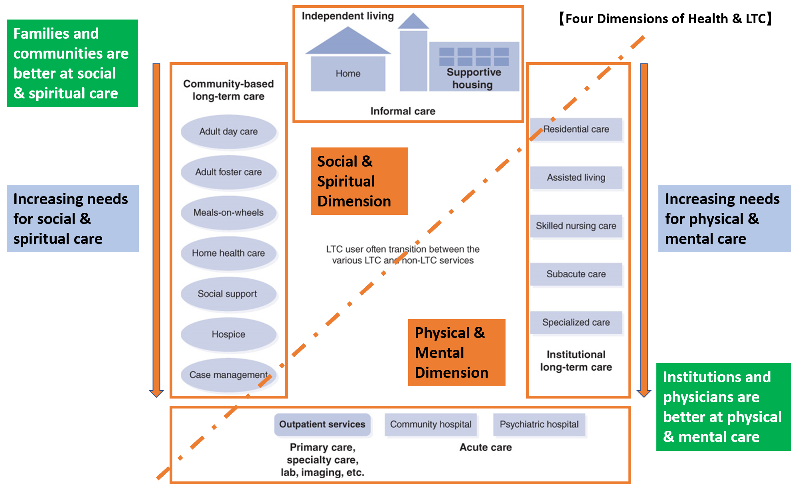

## Four Dimensions of Health and Long-Term Care

## Health Informatics Related to Aging and LTC
- Compare developed (US, Japan, Germany, UK, Canada, France, etc.) and developing (India, China) countries and found out their population, fertility, and aging.
- How they care for the elderly people - physical/mental, and social/spiritual needs. Family/community based vs institutional
- Cost/payment, Insurance, and financing of LTC
- Do differences in cultural have impact on how each country handle LTC?- 
- Where to get data and what analysis tools to use?
- Within US, compare different states, or urban, suburban, rural areas; compare among races and ethnic groups. 
- maybe looking at COVID-19 and its impact on LTC in general or nursing homes in specific

