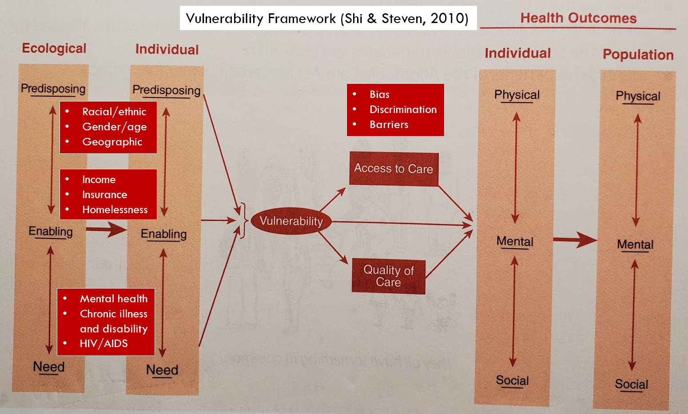

# Prep Notes for Online Session 7
## Group Project 2
- At least four countries
    - Each team member responsible for one country
    - Cover all seven aspects of a country
- Seven Aspects
    - Accessibility
    - Delivery
    - Financing
    - Cost (data visualizations)
    - Quality
    - Structure
    - Politics
 - Compare and contract 
     - Try to use tables and charts
     - Make it easier to compare and contrast
     
 ## Special Populations vs the General Population
 ### Definition of Vulnerable Populations
 > "Vulnerable populations are at risk for disparate healthcare access and outcomes because of economic, cultural, ethnic or health characteristics. 
 > Vulnerable populations include patients who are racial or ethnic minorities, children, elderly, socioeconomically disadvantaged, underinsured or 
 > those with certain medical conditions. Members of vulnerable populations often have health conditions that are exacerbated by unnecessarily inadequate healthcare."
 > https://journals.lww.com/co-anesthesiology/Abstract/2013/04000/Vulnerable_populations_in_healthcare.15.aspx#:~:text=Vulnerable%20populations%20include%20patients%20who,exacerbated%20by%20unnecessarily%20inadequate%20healthcare.
 ### Question - Vulnerable to what?
 -?
 -?
 -?
 ### Various Terminologies
- Underserved
- Medically underserved
- Medically disadvantaged
- Underpriviliged
- American underclasses
### Vulnerability Framework (Shi & Stevens, 2010)

- Predisposition (demogrophic/cultural)
    - Racial/Ethnic
    - Gender/Age
    - Geographic
- Enabling (socioeconomic)
    - Income
    - Insurance status
    - Homelessness
- Need (medical)
    - Mental health
    - Chronic illness and disability
    - HIV/AIDS
### Takeaways
- All three forces of vulnerability at work make an individual or a goupe of individuals even more vulnerable
- Social detterminants of health 
- Disparity/inequality/inequity in health and healthcare
- Health and healthcare as a previlige vs a right
- Research and Policy implications
### Current Affairs
- Appointment of Amy Coney Barrett to the supreme court
- Affordable Care Act (ACA, Obamacare)
    - Pre-existing conditions
    - Indidual mandate 
        - to reduce the number of uninsured
        - To help finance the increased coverage 
